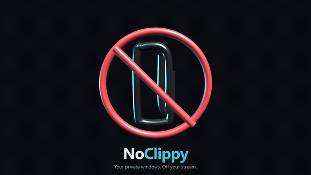
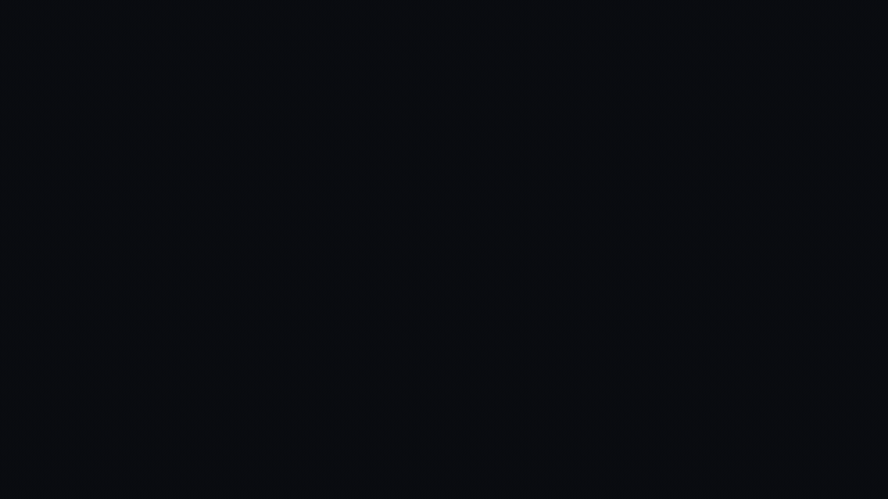
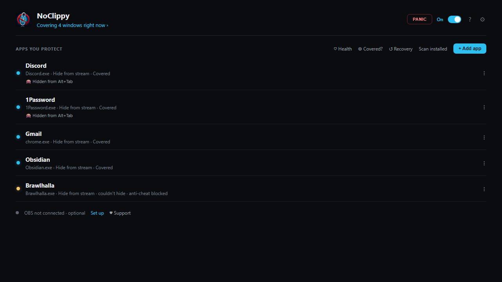

<p align="center">
  
</p>

# NoClippy

Keep private windows off your stream. Pick the apps you never want on stream, like Discord, your password manager or your email, and NoClippy hides them from OBS and every other capture while they look totally normal on your own screen.

Free for Windows 10 (2004+) and 11. No account, no telemetry.



## Download

**[Download the latest installer](https://github.com/Phaenex/noclippy-releases/releases/latest)**, the `NoClippy_<version>_x64-setup.exe` file.

Or with Scoop:

```powershell
scoop bucket add noclippy https://github.com/Phaenex/noclippy-releases
scoop install noclippy
```

Every file is signed. Right-click the installer, open Properties, then Digital Signatures, and it should say **Nicholas DAmato**. If it doesn't, it's not a real NoClippy build.

Windows may still show "Windows protected your PC" on a brand-new release. That's SmartScreen being careful with a new download, and it names the publisher. Click **More info**, then **Run anyway**. It stops asking once enough people have installed it.

## How it works

You make a rule for each app you want hidden. With protection on, NoClippy handles each window one of two ways:

- **Invisible (most apps).** Discord, browsers, Steam, Obsidian and the rest vanish from Display, Window and Game Capture. Viewers see whatever is behind them. You still see the app normally.
- **Black bar (automatic fallback).** Anything NoClippy won't touch, like anti-cheat games and in-game overlays, gets a black bar that follows the window instead of being left exposed.

You don't pick which. Each rule's status tells you: "Invisible on stream" or "Covered (black bar)".



## What else it does

- **Protect on launch** (on by default), so you never go live unprotected by accident
- **Hotkeys:** `Ctrl+Alt+M` toggles protection, `Ctrl+Alt+P` panics and covers everything, `Ctrl+Alt+S` screenshots your own hidden windows. All of them are changeable in Settings.
- **Leak fail-safe** (on by default): if a window can't be hidden at all, NoClippy minimizes it rather than leave it on stream. Nothing gets closed.
- **Lockdown mode** (opt-in): hide every window except the ones you mark stream-safe
- **OBS and Streamlabs:** turn protection on automatically when you go live
- **Stream Deck:** toggle, panic and switch profiles from your deck
- **Profiles** for different kinds of streams

## Honest limits

- Windows only. The Mac build is for development and doesn't protect anything.
- It isn't DRM. A phone pointed at your monitor still wins. It stops accidents, not a determined leak. More in [THREAT_MODEL.md](THREAT_MODEL.md).
- Antivirus sometimes flags the invisible mode, because it loads a small DLL into the app it's hiding. That's the same technique tools like Invisiwind use. NoClippy only does it for apps you made a rule for, never for anti-cheat games or in-game overlays, and the DLL is signed.

## Privacy

No account, no telemetry. NoClippy checks this page for updates when it starts, and talks to your own OBS or Streamlabs on your PC if you set that up. Your rules are a plain JSON file on your machine. Details and how to check it yourself: [PRIVACY.md](PRIVACY.md).

## Help

- Something stuck invisible in OBS after closing NoClippy? See [TROUBLESHOOTING.md](docs/TROUBLESHOOTING.md).
- Bugs and requests: [open an issue](https://github.com/Phaenex/noclippy-releases/issues).
- Questions and ideas: [Discussions](https://github.com/Phaenex/noclippy-releases/discussions).
- Security problems: [SECURITY.md](SECURITY.md). Please report those privately.

## Support

NoClippy is free and it's staying free. So is everything else I build. I make these on my own, and right now tips are what keep that possible. I was in school for AI and had to put it on hold this year, so if NoClippy ever kept a DM or a password off your stream, a few bucks does help.

- [Tip on Ko-fi](https://ko-fi.com/noclippyfree)
- [GitHub Sponsors](https://github.com/sponsors/Phaenex)

No paywall, no pro tier, no donation pop-ups.

## License

Free to use under the [PolyForm Noncommercial License 1.0.0](LICENSE). Use it for your own streams all you want. Just don't resell it or bundle it into something commercial. The source code isn't public. This repo holds the releases, the update feed and the docs.

Please read [ACCEPTABLE_USE.md](ACCEPTABLE_USE.md). NoClippy is for protecting your own privacy, not for hiding anything illegal.
